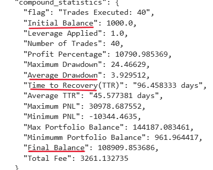

# Zelta_untrade
This is a quantitative trading strategy for Ethereum, whcih was developed as part of Zelta Untrade's competition. In this competition it was required to develop a trading strategy for Ethereum using various technical analysis, pattern recognition and statistical correlation techniques.
The effectives of the strategy was gauged on the basis of various parameters such as sharpe ratio, shortino ratio, time to recovery(TTR), Average drawdown, Final PnL, etc.
# Our Goal 
As this one is our first attempt at creating a trading strategy for a competition, we tried to keep our strategy simple but at the same time very impactful in terms of profit earned and minimized the drawdown experienced. 
# Ideas used to develop the strategy
Various methods to analyse asset price movement were combined to arrive at the final strategy.
# 1. Technical Analysis
   As we desired to develop a simple yet impactful strategy, we searched for patterns which gives a very strong and accurate buying or selling signal.
   So, we chose the appearance of engulfing pattern as one of our strategies.
   # Engulfing pattern
   
   
   Above picture shows the two candle structure of an engulfing pattern.
   
   The reason why this single pattern is a very accurate signal is that it signals a quick and strong trend reversal after a prolonged period of movement of market in a particular direction. 
   Although this signal in itself is quite good, it cannot be used in industry as a lot of false signals may be generated by it. This we have tried to improve by combining a few other tools to filter noise and give a good signal.
   # Refining the Signal
   # A. RSI
   The RSI(Relative Strength Index) is a momentum oscillator used to measure how strongly a price is moving up or down. Generally a value >70 is considered overbought zone while value <30 is considered oversold zone.
   
   These zones provide a good opportunity to initiate trades in a direction opposite to the current market direction as a trend reversal can be expected soon. Trades should not be initiated at mid levels of RSI as the dierction where the market can move cannot be ascertained.
   
   # B. Determination of direction of market before the pattern
   Engulfing patterns signal a possibe reversal of trend. So, it must be determined if the trend suggested by the pattern is opposite to the ongoing pattern.
   
   If a Bullish engulfing pattern appears, then it must be determined if the market was in a bearish zone few candles back.
   
   If a Bearish engulfing pattern appears, then it must be determined if the market was in a bullish zone few candles back.
   
   # C. Strength of Trend suggested by pattern 
   ADX(Average Directional Index) is a very useful tool to gauge the strength of a trend, regardless of the dircetion of the trend. It is used to determine if the market is trending or ranging.
   A value below 25 is generally indicates the market is ranging while a value above this indicates a trend, with the higher adx value indicating stronger trends. 
   In our strategy we have use ADX threshold of 31.
   
   In addition to this much better results are obtained if we wait for another candle after appearance of the engulfing pattern and determine if that candle is in the same direction as suggested by the pattern i.e. if a Bullish engulfing pattern appears then we enter the trade if the next candle is a green candle and if a Bearish engulfing pattern appears the we enter the trade if the next candle is a red candle. 

# Statistical Correlation
Bitcoin (BTC) is the most widely traded cryptocurrency, while Ethereum (ETH) holds the second position. Historically, ETH tends to mimic BTC’s price movements, reflecting a strong correlation between the two assets.

This project leverages the BTC-ETH correlation to enhance ETH trading signals derived from traditional technical indicators.
   # BTC-ETH Correlation 
   
   We compute a rolling correlation between BTC and ETH prices using a 7-tick window to capture short-term dependencies.
Only when the correlation exceeds 0.9 are ETH signals validated and executed.

This helps filter out false technical signals during periods when BTC and ETH decouple, improving strategy robustness.
# Dynamic Stoploss and Target  
Defining clear target and stop-loss levels is crucial — it’s often the difference between a profitable and a losing strategy.
However, fixed targets can limit profits or trigger premature exits when volatility changes.

To address this, the strategy implements a dynamic target–stoploss mechanism that adapts to market volatility and recent price behavior, ensuring better risk–reward balance in both trending and ranging markets:

If we are already in a long/short position and the strategy gives a buy/sell signal, the current stopless and target of the position are modified in accordance to the ATR (Average True Range) and closing price of ETH.

# Results
The strategy was backtested using zelta untrade's platform and the key metrics are summarized below:

Entry Points into Long Trades shown by Green arrows and entry into short trades shown by Red arrows.

Note: The strategy was tested using 30m ETH and BTC data spanning from 2019 to 2023  
